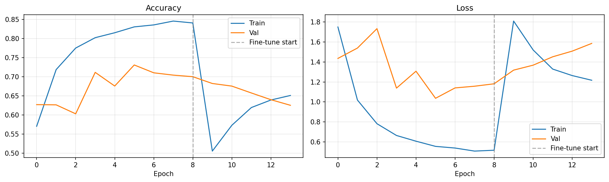

# 🌿 Crop Disease Detector v6

60 classes across: Apple, Blueberry, Cherry (including sour), Corn (maize), Cotton, Grape, Orange, Peach, Pepper, bell, Potato, Raspberry, Soybean, Squash, Strawberry, Sugarcane, Tomato, Wheat

